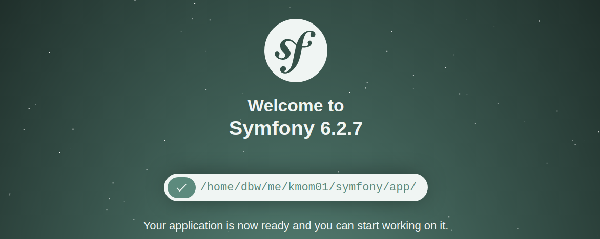

<!--
---
author: mos
revision:
    "2023-03-28": "(B, mos) Work through and very updated."
    "2022-03-27": "(A, mos) First release."
---
-->

Project for course Module View Controller (MVC) 
====================

The goal with this course and exercise is to practice and learn the concept of working in the rules of MVC.

The course follows the assignments that can be viewed on www.dbwebb.se/kurser/mvc-v2

For the final project I've decided to create a five card poker game against the computer. To start the local server simply use the bash script by typing bash start.bash the server will be running on port 8888.

For the final project i decided to rewrite the code for my deck and card classes because i found them lacking some functionality that made the code unnecessarly hard to write. All files in the folder Controller/Project are the classes i use to create the game (five hand poker).